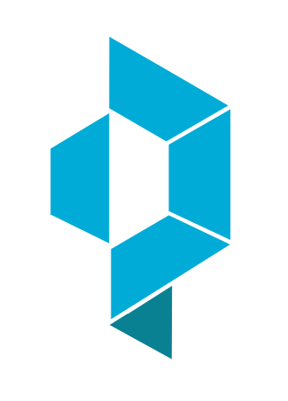
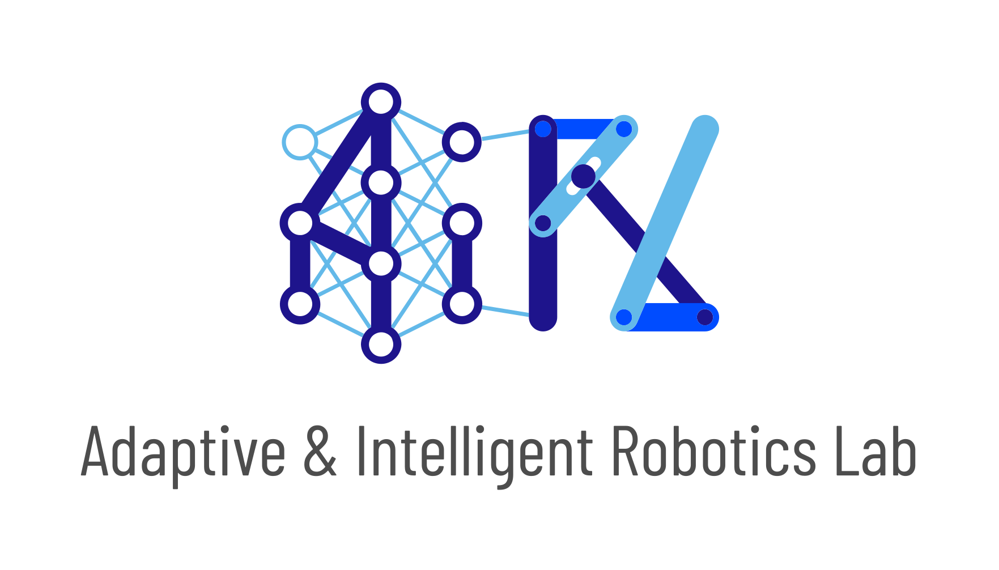

<div align="center">
</img>
</div>


# QDax: Accelerated Quality-Diversity

[](https://qdax.readthedocs.io/en/latest/?badge=latest)

[](https://github.com/adaptive-intelligent-robotics/QDax/blob/main/LICENSE)
[](https://codecov.io/gh/adaptive-intelligent-robotics/QDax)


QDax is a tool to accelerate Quality-Diversity (QD) and neuro-evolution algorithms through hardware accelerators and massive parallelization. QD algorithms usually take days/weeks to run on large CPU clusters. With QDax, QD algorithms can now be run in minutes! ⏩ ⏩ 🕛

QDax has been developed as a research framework: it is flexible and easy to extend and build on and can be used for any problem setting. Get started with simple example and run a QD algorithm in minutes here! [](https://colab.research.google.com/github/adaptive-intelligent-robotics/QDax/blob/main/examples/mapelites.ipynb)

- QDax [paper](https://arxiv.org/abs/2202.01258)
- QDax [documentation](https://qdax.readthedocs.io/en/latest/)


## Installation
QDax is available on PyPI and can be installed with:
```bash
pip install qdax
```
Alternatively, the latest commit of QDax can be installed directly from source with:
```bash
pip install git+https://github.com/adaptive-intelligent-robotics/QDax.git@main
```
Installing QDax via ```pip``` installs a CPU-only version of JAX by default. To use QDax with NVidia GPUs, you must first install [CUDA, CuDNN, and JAX with GPU support](https://github.com/google/jax#installation).

However, we also provide and recommend using either Docker or conda environments to use the repository which by default provides GPU support. Detailed steps to do so are available in the [documentation](https://qdax.readthedocs.io/en/latest/installation/).

## Basic API Usage
For a full and interactive example to see how QDax works, we recommend starting with the tutorial-style [Colab notebook](./examples/mapelites.ipynb). It is an example of the MAP-Elites algorithm used to evolve a population of controllers on a chosen Brax environment (Walker by default).

However, a summary of the main API usage is provided below:
```python
import jax
import functools
from qdax.core.map_elites import MAPElites
from qdax.core.containers.mapelites_repertoire import compute_euclidean_centroids
from qdax.tasks.arm import arm_scoring_function
from qdax.core.emitters.mutation_operators import isoline_variation
from qdax.core.emitters.standard_emitters import MixingEmitter
from qdax.utils.metrics import default_qd_metrics

seed = 42
num_param_dimensions = 100  # num DoF arm
init_batch_size = 100
batch_size = 1024
num_iterations = 50
grid_shape = (100, 100)
min_param = 0.0
max_param = 1.0
min_bd = 0.0
max_bd = 1.0

# Init a random key
random_key = jax.random.PRNGKey(seed)

# Init population of controllers
random_key, subkey = jax.random.split(random_key)
init_variables = jax.random.uniform(
    subkey,
    shape=(init_batch_size, num_param_dimensions),
    minval=min_param,
    maxval=max_param,
)

# Define emitter
variation_fn = functools.partial(
    isoline_variation,
    iso_sigma=0.05,
    line_sigma=0.1,
    minval=min_param,
    maxval=max_param,
)
mixing_emitter = MixingEmitter(
    mutation_fn=lambda x, y: (x, y),
    variation_fn=variation_fn,
    variation_percentage=1.0,
    batch_size=batch_size,
)

# Define a metrics function
metrics_fn = functools.partial(
    default_qd_metrics,
    qd_offset=0.0,
)

# Instantiate MAP-Elites
map_elites = MAPElites(
    scoring_function=arm_scoring_function,
    emitter=mixing_emitter,
    metrics_function=metrics_fn,
)

# Compute the centroids
centroids = compute_euclidean_centroids(
    grid_shape=grid_shape,
    minval=min_bd,
    maxval=max_bd,
)

# Initializes repertoire and emitter state
repertoire, emitter_state, random_key = map_elites.init(init_variables, centroids, random_key)

# Run MAP-Elites loop
for i in range(num_iterations):
    (repertoire, emitter_state, metrics, random_key,) = map_elites.update(
        repertoire,
        emitter_state,
        random_key,
    )

# Get contents of repertoire
repertoire.genotypes, repertoire.fitnesses, repertoire.descriptors
```


## QDax core algorithms
QDax currently supports the following algorithms:


| Algorithm                                                                                                                     | Example                                                                                                                                                                                         |
|-------------------------------------------------------------------------------------------------------------------------------|-------------------------------------------------------------------------------------------------------------------------------------------------------------------------------------------------|
| [MAP-Elites](https://arxiv.org/abs/1504.04909)                                                                                | [](https://colab.research.google.com/github/adaptive-intelligent-robotics/QDax/blob/main/examples/mapelites.ipynb)  |
| [CVT MAP-Elites](https://arxiv.org/abs/1610.05729)                                                                            | [](https://colab.research.google.com/github/adaptive-intelligent-robotics/QDax/blob/main/examples/mapelites.ipynb)  |
| [Policy Gradient Assisted MAP-Elites (PGA-ME)](https://hal.archives-ouvertes.fr/hal-03135723v2/file/PGA_MAP_Elites_GECCO.pdf) | [](https://colab.research.google.com/github/adaptive-intelligent-robotics/QDax/blob/main/examples/pgame.ipynb)      |
| [QDPG](https://arxiv.org/abs/2006.08505)                                                                                      | [](https://colab.research.google.com/github/adaptive-intelligent-robotics/QDax/blob/main/examples/qdpg.ipynb)       |
| [CMA-ME](https://arxiv.org/pdf/1912.02400.pdf)                                                                                | [](https://colab.research.google.com/github/adaptive-intelligent-robotics/QDax/blob/main/examples/cmame.ipynb)      |
| [OMG-MEGA](https://arxiv.org/abs/2106.03894)                                                                                  | [](https://colab.research.google.com/github/adaptive-intelligent-robotics/QDax/blob/main/examples/omgmega.ipynb)    |
| [CMA-MEGA](https://arxiv.org/abs/2106.03894)                                                                                  | [](https://colab.research.google.com/github/adaptive-intelligent-robotics/QDax/blob/main/examples/cmamega.ipynb)    |
| [Multi-Objective MAP-Elites (MOME)](https://arxiv.org/abs/2202.03057)                                                         | [](https://colab.research.google.com/github/adaptive-intelligent-robotics/QDax/blob/main/examples/mome.ipynb)       |
| [MAP-Elites Evolution Strategies (MEES)](https://dl.acm.org/doi/pdf/10.1145/3377930.3390217)                                  | [](https://colab.research.google.com/github/adaptive-intelligent-robotics/QDax/blob/main/examples/mees.ipynb)       |
| [MAP-Elites PBT (ME-PBT)](https://openreview.net/forum?id=CBfYffLqWqb)                                                        | [](https://colab.research.google.com/github/adaptive-intelligent-robotics/QDax/blob/main/examples/me_sac_pbt.ipynb) |
| [MAP-Elites Low-Spread (ME-LS)](https://dl.acm.org/doi/abs/10.1145/3583131.3590433)                                           | [](https://colab.research.google.com/github/adaptive-intelligent-robotics/QDax/blob/main/examples/me_ls.ipynb)      |


## QDax baseline algorithms
The QDax library also provides implementations for some useful baseline algorithms:

| Algorithm  | Example |
| --- | --- |
| [DIAYN](https://arxiv.org/abs/1802.06070) | [](https://colab.research.google.com/github/adaptive-intelligent-robotics/QDax/blob/main/examples/diayn.ipynb) |
| [DADS](https://arxiv.org/abs/1907.01657) | [](https://colab.research.google.com/github/adaptive-intelligent-robotics/QDax/blob/main/examples/dads.ipynb) |
| [SMERL](https://arxiv.org/abs/2010.14484) | [](https://colab.research.google.com/github/adaptive-intelligent-robotics/QDax/blob/main/examples/smerl.ipynb) |
| [NSGA2](https://ieeexplore.ieee.org/document/996017) | [](https://colab.research.google.com/github/adaptive-intelligent-robotics/QDax/blob/main/examples/nsga2_spea2.ipynb) |
| [SPEA2](https://www.semanticscholar.org/paper/SPEA2%3A-Improving-the-strength-pareto-evolutionary-Zitzler-Laumanns/b13724cb54ae4171916f3f969d304b9e9752a57f) | [](https://colab.research.google.com/github/adaptive-intelligent-robotics/QDax/blob/main/examples/nsga2_spea2.ipynb) |
| [Population Based Training (PBT)](https://arxiv.org/abs/1711.09846)                                                           | [](https://colab.research.google.com/github/adaptive-intelligent-robotics/QDax/blob/main/examples/sac_pbt.ipynb)    |

## QDax Tasks
The QDax library also provides numerous implementations for several standard Quality-Diversity tasks.

All those implementations, and their descriptions are provided in the [tasks directory](./qdax/tasks).

## Contributing
Issues and contributions are welcome. Please refer to the [contribution guide](https://qdax.readthedocs.io/en/latest/guides/CONTRIBUTING/) in the documentation for more details.

## Related Projects
- [EvoJAX: Hardware-Accelerated Neuroevolution](https://github.com/google/evojax). EvoJAX is a scalable, general purpose, hardware-accelerated neuroevolution toolkit. [Paper](https://arxiv.org/abs/2202.05008)
- [evosax: JAX-Based Evolution Strategies](https://github.com/RobertTLange/evosax)

## Citing QDax
If you use QDax in your research and want to cite it in your work, please use:
```
@misc{chalumeau2023qdax,
    title={QDax: A Library for Quality-Diversity and Population-based Algorithms with Hardware Acceleration},
    author={Felix Chalumeau and Bryan Lim and Raphael Boige and Maxime Allard and Luca Grillotti and Manon Flageat and Valentin Macé and Arthur Flajolet and Thomas Pierrot and Antoine Cully},
    year={2023},
    eprint={2308.03665},
    archivePrefix={arXiv},
    primaryClass={cs.AI}
}
```

## Contributors

QDax was developed and is maintained by the [Adaptive & Intelligent Robotics Lab (AIRL)](https://www.imperial.ac.uk/adaptive-intelligent-robotics/) and [InstaDeep](https://www.instadeep.com/).

<div align="center">
 
</div>

<div align="center">
<a href="https://github.com/limbryan" title="Bryan Lim"></a>
<a href="https://github.com/maxiallard" title="Maxime Allard"></a>
<a href="https://github.com/Lookatator" title="Luca Grilloti"></a>
<a href="https://github.com/manon-but-yes" title="Manon Flageat"></a>
<a href="https://github.com/Aneoshun" title="Antoine Cully"></a>
<a href="https://github.com/felixchalumeau" title="Felix Chalumeau"></a>
<a href="https://github.com/ranzenTom" title="Thomas Pierrot"></a>
<a href="https://github.com/Egiob" title="Raphael Boige"></a>
<a href="https://github.com/valentinmace" title="Valentin Mace"></a>
<a href="https://github.com/GRichard513" title="Guillaume Richard"></a>
<a href="https://github.com/flajolet" title="Arthur Flajolet"></a>
<a href="https://github.com/remidebette" title="Rémi Debette"></a>
</div>
